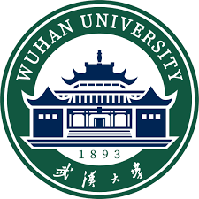

<!--
 * @Author: StevenHH2000 hlxhe2000@hotmail.com
 * @Date: 2025-04-17 02:39:36
 * @LastEditors: StevenHH2000 hlxhe2000@hotmail.com
 * @LastEditTime: 2025-04-17 03:05:55
 * @FilePath: /code/hehulingxiao.github.io/_pages/about.md
 * @Description: 这是默认设置,请设置`customMade`, 打开koroFileHeader查看配置 进行设置: https://github.com/OBKoro1/koro1FileHeader/wiki/%E9%85%8D%E7%BD%AE
-->
---
permalink: /
title: "Hulingxiao He (何胡凌霄)"
author_profile: true
redirect_from: 
  - /about/
  - /about.html
---

## Biography

I am a second-year Ph.D. student, advised by [Prof. Yuxin Peng](http://39.108.48.32/mipl/pengyuxin/) of [MIPL Lab](http://39.108.48.32/mipl/home/) from [Wangxuan Institute of Computer Technology](https://www.wict.pku.edu.cn/), [Peking University](https://www.pku.edu.cn/).

My current research mainly focuses on **multi-modal large language models** (MLLMs), particularly MLLMs for fine-grained visual tasks like fine-grained visual recognition (FGVR). These works have been published in **ICLR'25**, with a paper currently under review at **ACM MM'25**.

<!-- During my Ph.D., my research interests include **video understanding, multi-modal, and AIGC**. I am particularly interested in exploring efficient modality aggregation, optimized model architectures, .and close integration with real-world scenarios, which I believe are essential technological foundations for a universal AI assistant -->

<!-- You can find my CV here: [Yanzhe Chen's Curriculum Vitae](../assets/1_CV_YanzheChen.pdf). -->

<!-- [Email](mailto:chenyanzhe@stu.pku.edu.cn) / [Github](https://github.com/ChenAnno) / [Wechat](../images/wechat.png) -->

## Experience

- **Ph.D. Student**    
   MIPL Lab, Peking University (PKU)   
  August 2023 - Now  
  Mainly focusing on multi-modal large language models, particularly MLLMs for fine-grained visual tasks like fine-grained visual recognition (FGVR). These works have been published in **ICLR'25**, with a paper currently under review at **ACM MM'25**.
  Advisor: Yuxin Peng

- **Intern**    
   Multimedia Understanding Team (MMU), Kwai Technology   
  December 2022 - June 2025   
  Undertaking independently a collaborative project with Kuaishou Technology, focusing on fine-grained product retrieval in short videos, applied within Kuaishou app's search/recommendation scenarios , significantly boosting Gross Merchandise Volume (GMV).  
  Mentor: Huasong Zhong and Lele Cheng

- **Undergraduate Student**    
   Wuhan University (WHU)   
  August 2018 - July 2022    
  GPA: 3.96/4.0, ranked 1st out of 272 in Computer Science and Technology. Focused on medical image analysis, awarded Wuhan University Outstanding Thesis.    
  Advisor: Dengyi Zhang  

## Selected Awards

- China National Scholarship, 2020   

- Champion of the Disaster Scene Description and Indexing Task at TREC 2022  

- Wuhan University Outstanding Thesis and Wuhan University Outstanding Graduate honors, 2022  
